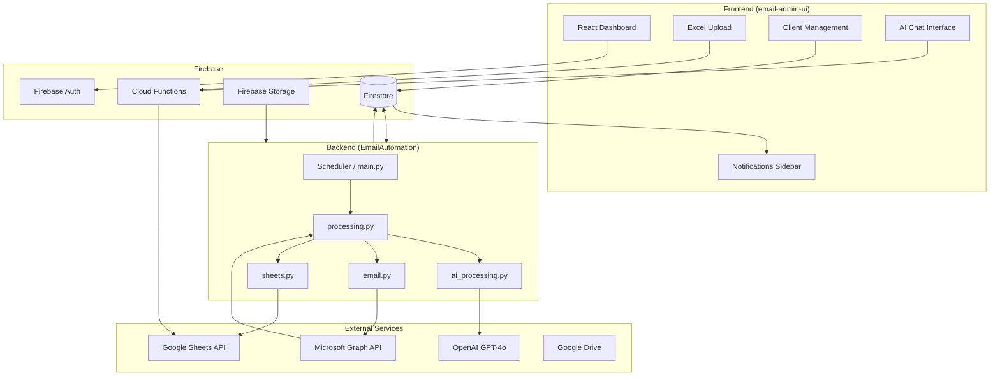
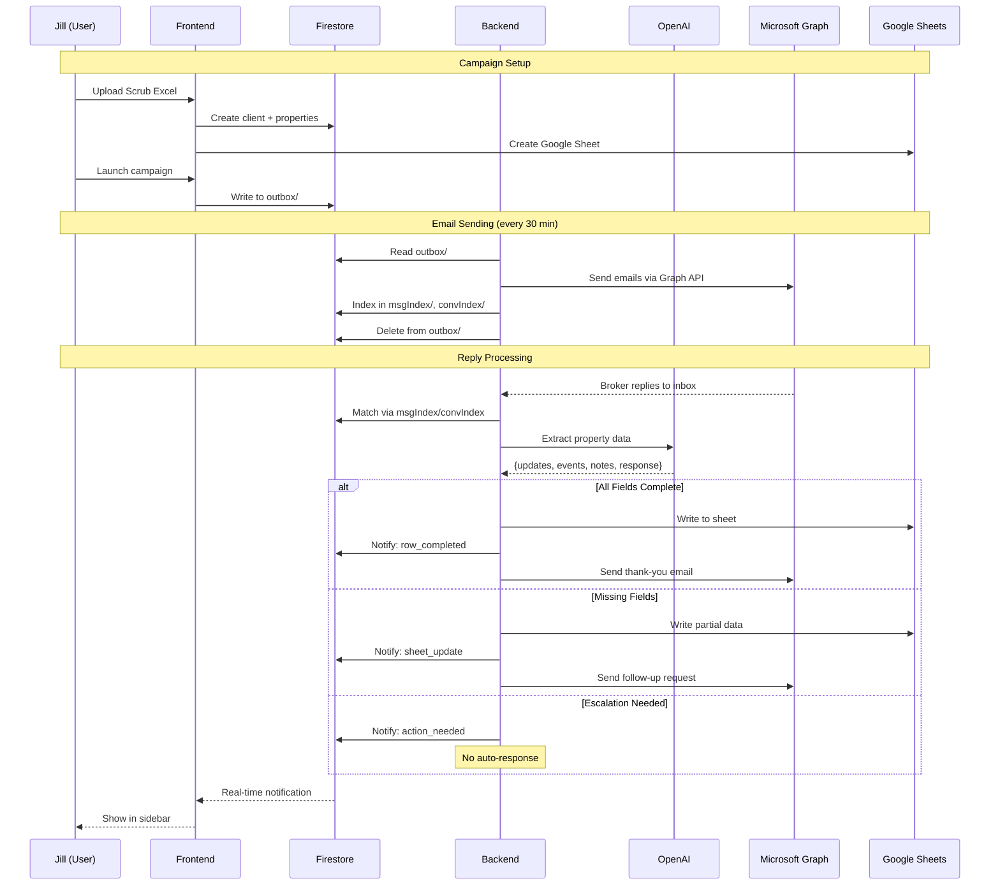
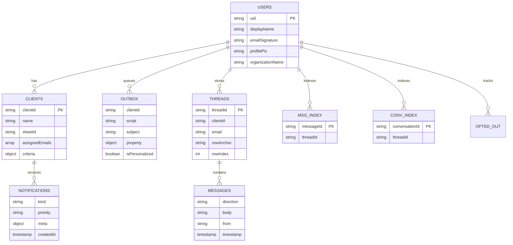
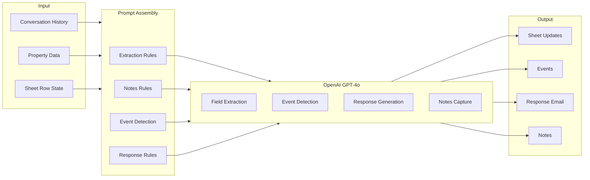
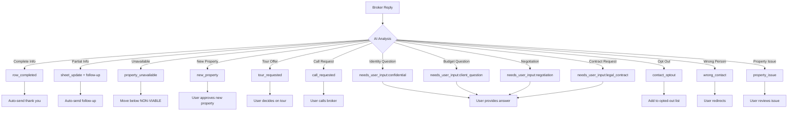
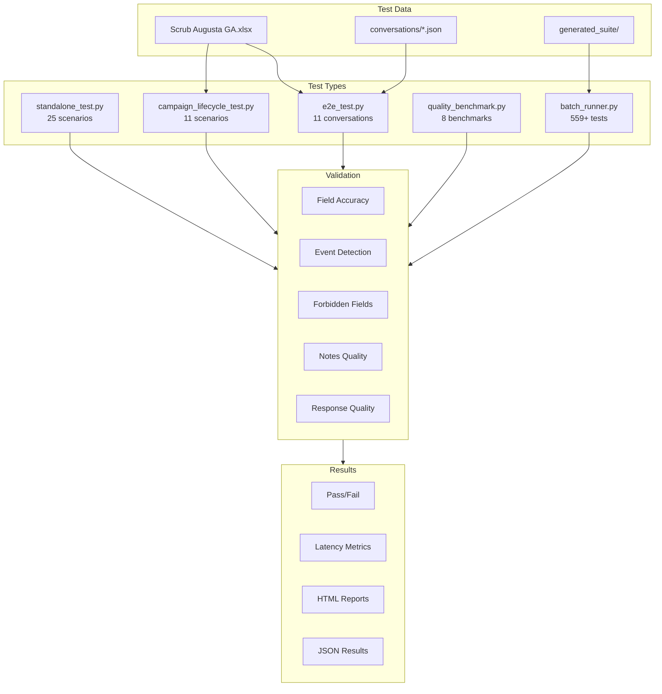
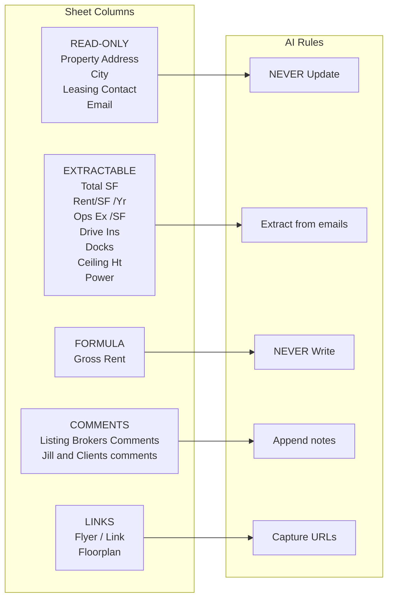
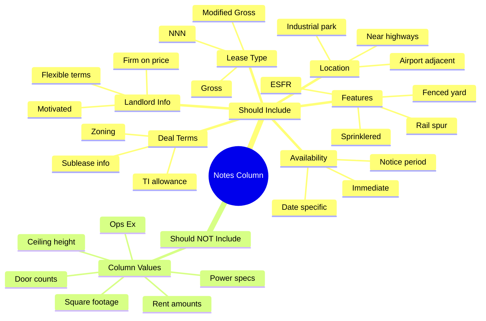
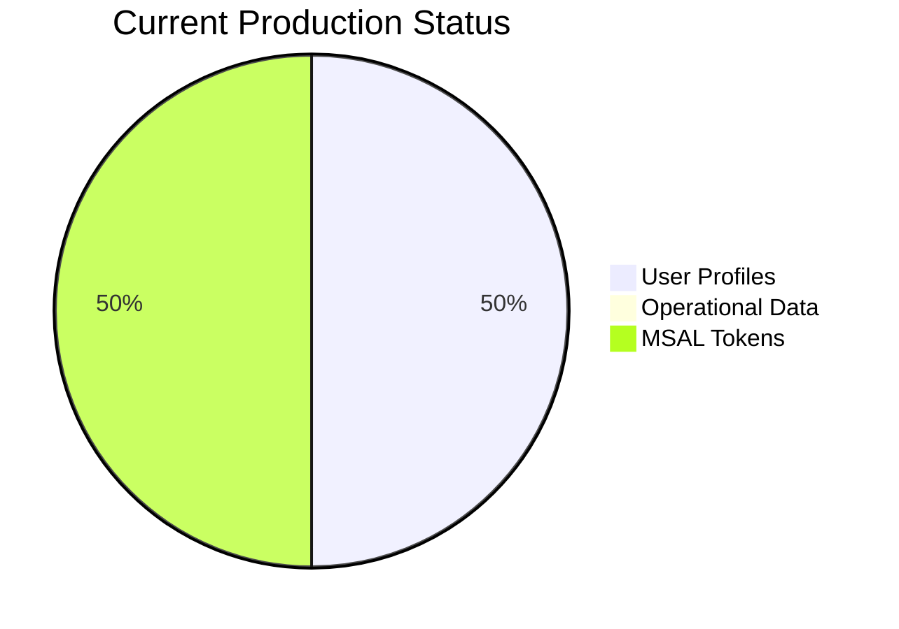
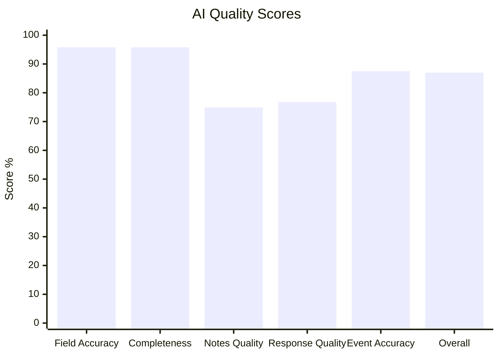

# Email Automation System Architecture

## High-Level System Overview

## Data Flow - Campaign Lifecycle

## Firestore Data Structure

## AI Processing Pipeline

## Event Types & Handling

## Testing Infrastructure

## Sheet Column Flow

## Notes Quality Criteria

## Production State

## Quality Metrics

