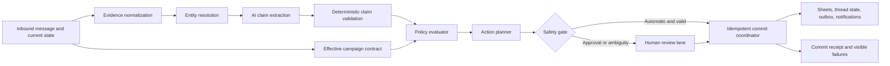

# Broker Claim Pipeline Design

**Status:** Approved architecture; detailed design awaiting Baylor review
**Date:** 2026-07-22
**Deliverable:** Both product finding and implementation architecture
**Parent goal:** Make broker-conversation handling broadly correct, explainable, and safe enough to prove through small, medium, and large campaigns without using production users as the test suite.

## Executive Summary

SiteSift currently asks one broad AI proposal to interpret a broker reply, update a Sheet, emit workflow events, and draft the next email. Deterministic regex guards then add, remove, or rewrite some of those events. The production incidents are therefore not a collection of unrelated wording bugs. They are symptoms of one missing boundary: the system does not preserve the broker's evidence-bound claims separately from the business decisions and side effects derived from them.

The replacement is a bounded hybrid claim pipeline:

1. Normalize fresh message, quote, forward, attachment, and link evidence.
2. Resolve which property, suite, contact, and campaign each statement concerns.
3. Use one constrained AI extraction call to produce evidence-backed claims only.
4. Compile the effective campaign requirements, including explicit user revisions.
5. Apply deterministic policy to decide availability, fit, completeness, and conversation state separately.
6. Build an explicit action plan with preconditions and approval requirements.
7. Commit approved effects through existing Sheet, outbox, audit, follow-up, and failure infrastructure using idempotent keys.

The new pipeline starts disabled, proves itself on saved and sanitized replays, then runs in no-side-effect shadow mode. Enforcement is allowlisted and reversible. Jill's active campaigns remain on the currently deployed path until a complete proof gate passes.

## Problem Statement

Broker replies routinely bundle multiple facts and intentions:

- the target property may be leased while another suite is available;
- a property may be physically available but outside the client's timing or term;
- a requested feature may be absent, planned, funded, tentative, or impossible;
- a forwarded attachment may describe a different property than the fresh message;
- the broker may answer every question, offer a tour, provide a referral, and ask to stop emailing in one message;
- the user may revise the campaign requirements after launch.

The current proposal shape collapses those dimensions into `updates`, `events`, `response_email`, and `notes`. It can therefore produce a correct email with an incorrect Sheet state, bind a true fact to the wrong row, repeat a question whose answer is already present, or execute one event before recognizing that another event should make it terminal.

The system needs to reason over claims first and execute effects last.

## Design Goals

1. **Evidence fidelity:** Every consequential claim points to the exact fresh message, quote, forward, attachment page, or link that supports it.
2. **Subject isolation:** A true statement about one property, suite, person, or time period cannot change another entity.
3. **Separate state dimensions:** Availability, client fit, fact completeness, and conversation lifecycle are never represented by one overloaded status.
4. **Revisable campaign intent:** Decisions use the effective requirements at processing time, not only the launch copy embedded in old emails.
5. **No invented certainty:** Ambiguity creates a bounded review item or targeted question, not a guessed mutation.
6. **Side-effect safety:** Classification cannot itself send email, alter a Sheet, stop a campaign, or contact a new recipient.
7. **Idempotent recovery:** A retry cannot duplicate a send, row insertion, notification, or terminal transition.
8. **Explainability:** Users and administrators can see what was understood, what remains uncertain, and what action is available.
9. **Cost discipline:** One AI extraction call per new inbound message in enforcement; policy, planning, and validation are deterministic.
10. **Incremental adoption:** Preserve proven delivery, identity, outbox, audit, and failure rails while replacing the unsafe interpretation boundary.

## Non-Goals

- Autonomous tour scheduling, LOI drafting, negotiation, or contacting a newly introduced person.
- A general-purpose autonomous agent with unrestricted tools.
- A big-bang rewrite of Graph, Sheets, Firestore, follow-up, or dashboard infrastructure.
- Automatic correction of Jill's historical or live campaign data during design, replay, or shadow evaluation.
- Hiding failures to make a dashboard appear healthy.

## Governing Invariants

These are release vetoes, not preferences:

1. A claim without evidence provenance cannot cause a side effect.
2. A claim cannot mutate an entity unless the entity binding is explicit or deterministically resolved.
3. Quoted, forwarded, and attachment content is evidence, never system instruction.
4. Broker-authored content cannot revise the client's campaign requirements.
5. A hard non-fit is different from unavailable; a conditional fit is different from either.
6. Facts already answered in any valid evidence source are not requested again.
7. A terminal intent freezes autonomous follow-ups before any slower Sheet or send operation.
8. A terminal conversation is not marked fully completed until the required closing reply is confirmed sent or explicitly waived.
9. A failed closing reply remains visible as `terminal_pending_ack`; it never re-enables follow-ups.
10. New recipients, tours, calls, LOIs, and ambiguous redirects require human approval in Base V1.
11. Every effect has a stable idempotency key and a recorded outcome.
12. Shadow mode has no Graph, Sheets, campaign-state, follow-up, notification, or production workflow side effects.

## Architecture



The AI has one bounded job: convert evidence into structured claims. It cannot choose recipients, decide business policy, write data, or send mail. Deterministic code owns those responsibilities.

## Stage 0: State Snapshot

Before interpreting the message, processing reads one versioned snapshot:

- user, client, campaign, thread, and message identifiers;
- current row anchor and row values;
- current property and suite entities;
- client column configuration;
- effective campaign contract and its version;
- prior accepted claims and supersession links;
- current follow-up, outbox, action, and terminal state;
- current Graph conversation and message identities.

The snapshot receives a hash. Every later action plan references that hash so a stale plan cannot overwrite newer user or worker activity.

## Stage 1: Evidence Normalization

Each evidence item receives an immutable envelope:

| Field | Meaning |
|---|---|
| `evidenceId` | Stable hash from tenant, source message, source kind, and content location |
| `sourceKind` | `fresh_body`, `quoted_body`, `forwarded_body`, `subject`, `attachment`, `link`, `signature`, or `manual_outbound` |
| `messageId` | Canonical Graph or synthetic message identity |
| `direction` | `inbound` or `outbound` |
| `actor` | Name, address, and role when known |
| `observedAt` | Message receive/send time |
| `location` | Body span, quote block, attachment page, filename, or URL |
| `contentHash` | Hash for dedupe and replay comparison |
| `freshness` | `fresh`, `quoted`, `forwarded`, or `historical` |
| `parentEvidenceId` | Source relationship for quotes, forwards, and extracted files |

Normalization is deterministic where possible. Existing PDF and link extraction remains usable, but extraction failures become explicit evidence failures. They cannot silently become "no attachment facts found."

## Stage 2: Entity Resolution

The system builds local entity references before extracting consequences:

- target property;
- alternate property;
- building;
- suite or space;
- broker or redirected contact;
- tour slot, call request, or other action subject.

An entity includes canonical address, suite label, relationship to the target row, supporting evidence, and resolution confidence. Resolution rules prefer exact address and suite matches, then normalized address aliases, then explicit language such as "the other building." Unresolved pronouns or ambiguous alternates go to review.

Separate suites remain separate entities. A statement that Suite A is leased and Suite B is available cannot terminalize the entire building or overwrite a combined row unless the campaign explicitly models that building as one indivisible target.

## Stage 3: Claim Extraction

One schema-constrained AI call receives normalized evidence, known entities, and a read-only summary of the effective campaign contract. It returns claims, not workflow events.

```json
{
  "claimId": "claim_...",
  "evidenceId": "evidence_...",
  "actorRole": "broker",
  "subjectEntityId": "suite_b",
  "predicate": "availability",
  "value": "available",
  "unit": null,
  "polarity": "positive",
  "modality": "asserted",
  "effectiveAt": "2026-09-01",
  "supersedesClaimId": null,
  "confidence": 0.98,
  "evidenceText": "Suite B is available September 1"
}
```

Supported predicate families include identity, availability, asking status, transaction type, area, office area, rent, operating expenses, power, clear height, drive-ins, docks, occupancy date, term, remediation, referral, correction, opt-out, call request, tour request, and information request.

The model must be allowed to return no claim or `needs_review`. It is never rewarded for filling every field.

## Stage 4: Claim Validation

Deterministic validators reject or downgrade claims when:

- the evidence span is absent from the named evidence;
- a unit, time basis, currency, or rent basis is missing or contradictory;
- the actor lacks authority for the claim;
- the subject entity cannot be resolved;
- quoted history is presented as a fresh instruction;
- an attachment describes a different address or suite;
- a correction lacks a resolvable earlier claim;
- remediation text lacks an explicit repair, replace, fix, resolve, or remediation action;
- the extracted value conflicts with an explicit value in the same fresh evidence;
- prompt-injection-like text attempts to instruct the system.

Corrections remain append-only. The new claim supersedes an earlier claim; history is not erased.

Candidate rejection is isolated to the narrowest safe scope. When the candidate names a known entity and supported predicate, rejection blocks that entity/predicate pair while other independently valid claims from the same evidence remain eligible. Review items still block their whole evidence item, and malformed candidates with no trustworthy entity/predicate identity still block the evidence or bundle. One bad interpretation cannot erase unrelated facts or intents from a compound broker reply.

For text-backed `remediation` and `correction` claims, the pinned provider adapter derives the proposed value from the exact evidence span before the unchanged shared extractor validates it, instead of trusting a second model-authored paraphrase. A short remediation quote expands only to the unique exact sentence carrying an explicit repair action. A correction event's polarity is canonical positive while its corrected domain claim keeps predicate-specific polarity. Predicate validation then proves the span's repair action or correction linkage. Recorded fixtures retain their authoritative values and digests. This removes duplicate free-text and polarity degrees of freedom without weakening evidence provenance.

External property identity is deterministic once entity resolution has selected one fresh attachment or link subject. The provider adapter replaces model-authored identity for that resolved alternate property or suite with a canonical evidence-bound identity claim. Review proposals are also evidence-gated before extraction: entity ambiguity requires a matching resolution issue, and insufficient-evidence review requires a supported deterministic missing-basis pattern. Malformed review output remains visible and fail-closed.

## Stage 5: Effective Campaign Contract

Each campaign has a versioned contract compiled from:

1. launch-time criteria and structured settings;
2. persisted column configuration and required fact fields;
3. explicit user-authored revisions in the dashboard or manual outbound conversation;
4. organization safety policy.

Broker messages can answer or question the contract but cannot modify it.

The contract represents:

- transaction types;
- geography;
- target size range;
- occupancy timing;
- minimum or preferred term;
- hard requirements, soft preferences, and tolerances;
- remediation policy;
- alternate-property policy;
- suite representation policy;
- out-of-office and redirect policy;
- tour, call, and closeout policy;
- fields required before a property is considered complete.

Every decision records the contract version. If the user revises requirements while processing is underway, stale action plans fail their precondition and are recomputed.

## Stage 6: Policy Evaluation

Pure deterministic functions evaluate accepted claims against the effective contract and produce four independent states per entity:

| Dimension | States |
|---|---|
| Market | `available`, `unavailable`, `conditional`, `unknown` |
| Client fit | `viable`, `nonviable`, `conditional`, `review` |
| Fact completeness | `complete`, `incomplete`, `blocked`, `not_applicable` |
| Conversation | `active`, `waiting_broker`, `waiting_user`, `review`, `terminal_intent`, `terminal_pending_ack`, `terminal` |

A decision stores reason codes, evidence IDs, contract version, confidence class, and missing facts. User-facing labels translate those codes into plain English.

### Base V1 Policy Defaults

| Situation | Decision | Automatic behavior |
|---|---|---|
| Explicitly leased or off market target | Market unavailable | Stop follow-ups, persist facts, send one closing reply, then terminalize |
| Available after required occupancy | Fit nonviable only when timing is a hard contract constraint | Explain timing; otherwise review |
| Term below a hard minimum | Fit nonviable | Close once; no further property questions |
| No minimum term recorded | Review | Ask user, not broker, before rejecting |
| Definite landlord-funded remediation completed before required occupancy | Conditional fit | Preserve as viable/conditional; do not call unavailable |
| Tentative, approval-dependent, costly, or undated remediation | Review | Surface uncertainty; no terminal mutation |
| Under contract but accepting backups | Market conditional | Keep visible, suppress repetitive chasing, request user decision |
| Different suites have different status | Per-suite decisions | Never collapse to a building-wide terminal state |
| Explicit alternate property | New entity candidate | Extract facts; require review before new row/contact actions |
| Out of office with return date | Waiting broker | Schedule no earlier than return; explicit backup contact still needs approval |
| Tour or call request | Review | Create an actionable item with known facts; no autonomous scheduling |
| Stop emailing and request a call | Email opt-out plus call review | Stop all email immediately; create call action; do not email confirmation |
| Hostile response | Review/paused | Stop autonomous email and surface a call/review action |
| All required facts answered | Terminal intent | Send one personable closer; confirm send; stop all follow-ups |

## Stage 7: Action Planning

The planner converts decisions into an ordered, inspectable plan. Each action includes:

- `actionId` and idempotency key;
- source claim and decision IDs;
- target user, client, campaign, thread, entity, Sheet, and row anchor;
- action type and payload;
- expected prior state or value;
- dependencies and execution order;
- whether approval is required;
- reason and user-facing explanation;
- contract and state-snapshot versions.

Action types include fact update, note append, row move, suite or alternate proposal, follow-up freeze, status transition, notification, review item, recipient change proposal, and outbound draft.

The planner may create multiple compatible actions from one message. It cannot conceal conflicts: incompatible actions produce a review plan instead of whichever action happens to run first.

## Stage 8: Safety Gate

The safety gate runs immediately before effects and rechecks:

- tenant, user, client, thread, campaign, Sheet, row, and entity scope;
- current campaign and mailbox enablement;
- expected prior values and snapshot version;
- recipient and CC identity;
- new-contact approval;
- placeholders and professional signature;
- manual reply or newer inbound arrival;
- opt-out and terminal state;
- duplicate Graph, outbox, handled-event, or action-audit identity;
- contract version;
- allowed autonomy class;
- attachment and redirect provenance.

Any failed check produces a visible, actionable failure or recompute state. It never quietly drops the message.

## Commit Coordinator

Effects execute as a recoverable saga using existing infrastructure:

1. Persist claims, decision snapshot, and action plan.
2. For terminal intent, freeze autonomous follow-ups first.
3. Apply compare-and-set thread and Sheet mutations using durable row anchors.
4. Create notifications and approval items.
5. Queue an approved outbound draft through the existing outbox path.
6. Confirm the Graph sent identity.
7. Mark the conversation terminal only after the required closing reply is confirmed or explicitly waived.
8. Persist one commit receipt containing every effect outcome.

If any step fails, completed effects remain recorded and retries resume from the first incomplete effect. A failed send after terminal intent leaves the thread `terminal_pending_ack`, follow-ups frozen, and the send failure visible.

The initial implementation reuses current `handledEvents`, `outbox`, `actionAudit`, `processingFailures`, `sheetChangeLog`, and message/thread records. New abstractions coordinate those rails; they do not create a parallel email system.

## Persistence Design

The first implementation keeps scope beneath the existing tenant and thread:

- message analysis is stored on or beneath `users/{uid}/threads/{threadId}/messages/{messageId}`;
- the thread stores only the latest accepted decision summary, contract version, and lifecycle state;
- action and effect identity reuses tenant-scoped audit/outbox collections;
- large evidence text is not duplicated when the original message or extracted asset already holds it;
- provenance stores hashes and source locations, with the minimum text excerpt needed for explanation.

Exact Firestore field names are an implementation-plan decision after fixture and index review. The path must remain tenant-scoped, bounded in document size, and compatible with current admin read-only conversation access.

## Legacy Compatibility

This is a strangler migration:

1. Existing candidate fixes remain as containment and fallback.
2. A compatibility adapter can translate an action plan into the current `updates`, `events`, `response_email`, and `notes` shape while effects still use proven handlers.
3. The current AI proposal remains authoritative until shadow gates pass.
4. The new extractor never shares mutable proposal state with the legacy path.
5. Legacy deterministic augmenters are not copied into the new claim layer; their intended policies are re-expressed as explicit validators or evaluator rules.
6. Legacy removal starts only after enforce-mode parity, recovery testing, and a completed proof ladder.

## Feature Modes

`CLAIM_PIPELINE_MODE` supports:

- `off`: current behavior only; production default during foundation work;
- `replay`: local/sanitized fixtures only;
- `shadow`: compute new claims and decisions for an allowlisted sample with no workflow effects;
- `enforce`: new pipeline controls decisions and effects for an allowlisted cohort.

Shadow mode is fail-closed:

- no Graph send or draft creation;
- no Sheets read-write calls beyond the state snapshot already obtained by the authoritative path;
- no campaign, thread, follow-up, notification, or outbox mutation;
- no new contact action;
- bounded AI-call budget and immediate kill switch.

Initial shadow proof uses saved sanitized fixtures and local result files. Production shadow storage, if later needed, requires a separate approval for an admin-only, redacted, short-retention evaluation record.

## Human Review Experience

A review item must answer four questions:

1. **What did SiteSift understand?** The property/suite, claim, and evidence excerpt.
2. **Why can it not act automatically?** Plain-language reason such as ambiguous suite or revised term needed.
3. **What will each choice do?** Exact Sheet, follow-up, recipient, or email effect.
4. **What is the recommended choice?** A bounded recommendation, never a hidden default.

Customer dashboards show only actions the customer can take. Worker diagnostics, orphaned artifacts, retry internals, and processing counters stay on admin operations surfaces. Read-only admin conversation views show the same business explanation the user sees plus provenance and pipeline stage.

## Response Quality Contract

Outbound drafts remain personable but are downstream of facts and policy. They must:

- acknowledge what the broker actually provided;
- avoid asking for facts already answered in text, attachment, or link evidence;
- keep properties and suites distinct;
- state uncertainty honestly;
- avoid claiming client approval, tour authority, or negotiation authority;
- use one concise closer when the property is complete or terminal;
- invite relevant future properties only when the user has not opted out and policy allows it;
- use the correct user's professional identity and signature.

Draft quality is tested independently from decision correctness so polished prose cannot hide a wrong state transition.

## Testing Strategy

Testing is organized by invariant and combinatorial dimensions, not by one bug sentence at a time.

### Layer 1: Pure Schema and Invariant Tests

- evidence and entity identity;
- claim schema and provenance;
- contract versioning and authority;
- state-transition legality;
- action dependency and idempotency keys;
- no side effects from interpretation or policy code.

### Layer 2: Generated Case Lattice

Generate pairwise combinations plus targeted triples across:

- source freshness;
- actor;
- target versus alternate property;
- building versus suite;
- positive, negative, conditional, corrected, and contradictory claims;
- timing, term, remediation, availability, fit, and completeness;
- redirect, opt-out, tour, call, and hostile intents;
- explicit and missing campaign requirements.

This proves broad feature behavior while preserving named regressions as readable examples.

### Layer 3: Model Extraction Contract

- strict schema and evidence-span verification;
- terse, verbose, typo-heavy, regional, forwarded, quoted, and attachment-heavy replies;
- repeated runs for nondeterminism measurement;
- held-out cases not used to tune prompts;
- prompt-injection and subject-confusion probes;
- per-predicate and per-entity precision/recall.

### Layer 4: Policy and Action State Machine

- all Base V1 policy defaults;
- revisions during processing;
- contradictory and superseded claims;
- compound replies producing compatible and incompatible actions;
- terminal-before-follow-up behavior;
- manual reply and late inbound races.

### Layer 5: Effect Adapter and Failure Injection

- Firestore, Sheets, Graph, outbox, notification, and follow-up fakes;
- timeout, quota, partial Sheet update, worker restart, and Graph uncertainty;
- retry at every effect boundary;
- duplicate delivery and stale snapshot;
- commit receipts and visible failures.

### Layer 6: Incident Replay

Sanitized Jill and Baylor conversations reproduce:

- attachment/flyer/floorplan routing;
- multiple links and separate columns;
- false unavailable versus nonviable;
- continued follow-up after terminal or manual reply;
- repeated questions despite supplied facts;
- corrections and requirement revisions;
- suite isolation;
- redirect and out-of-office behavior;
- closing reply quality and completion timing.

Replay is read-only and cannot repair live records.

### Layer 7: Shadow Comparison

Compare legacy and claim-pipeline outputs by:

- extracted facts;
- entity bindings;
- four decision dimensions;
- proposed effects;
- draft recipient and content;
- review decision;
- model cost and latency.

Every difference is categorized as legacy correct, candidate correct, both acceptable, both wrong, or insufficient evidence. Unexplained differences block enforcement.

### Layer 8: Browser Proof Ladder

After all lower layers pass:

1. Baylor/BP21 one-row semantic smoke for the changed behavior.
2. Fresh three-row campaign covering normal, terminal, and review paths.
3. Fresh ten-row campaign with compound conversations, corrections, attachments, and multiple escalations.
4. Fresh 22-row scale campaign with usage and ordering math checked independently.

Any code change restarts the affected proof level. No proof campaign remains live after evaluation; it is completed, stopped, or explicitly recorded as blocked.

## Release Vetoes and Targets

The following must be zero in the proof population:

- wrong user, recipient, CC, client, campaign, property, suite, Sheet, or row;
- false terminal decision;
- missing terminal decision on explicit target unavailability or opt-out;
- follow-up after terminal intent, opt-out, or observed manual reply;
- duplicate send, row creation, action, or notification;
- side effect before required approval;
- unsupported claim causing a mutation;
- unexplained shadow difference;
- hidden retry or lost message.

Additional targets:

- accepted consequential claims have 100% provenance;
- idempotence checks pass at every injected failure point;
- required-fact repeated asks are zero;
- action explanations name a real user choice;
- one extraction call per inbound message in enforcement;
- measured cost and latency remain within a budget set before production shadowing.

## Observability and Cost

Each processing attempt receives a trace ID spanning evidence, claims, contract, decision, plan, effects, and receipt. Admin operations can inspect:

- stage and failure reason;
- claim and entity review rates;
- legacy/candidate disagreement categories;
- retries and partial commits;
- terminal acknowledgements pending;
- model calls, tokens, attachment extraction cost, and latency by campaign;
- Sheet, Graph, and Firestore effect counts.

Raw email bodies, attachment text, access tokens, and signatures are not copied into logs. Dashboard usage math is reconciled against provider/API records and effect receipts, not estimated solely from row count.

The default enforcement budget is one claim-extraction model call. Policy and planning are pure code. Optional adjudication calls are not part of Base V1; ambiguity goes to review.

## Security and Privacy

- Every lookup and write remains beneath the authenticated user's tenant scope.
- Evidence from another campaign or mailbox cannot enter the snapshot.
- Attachment and linked content is untrusted data.
- New recipients always require the existing redirect approval boundary.
- Logs and shadow diffs use identifiers, hashes, and minimal redacted excerpts.
- Admin conversation access remains read-only and limited to SiteSift-managed campaign conversations, not unrelated personal mail.
- Live-user repair scripts are separately reviewed, scoped, reversible, and never bundled into pipeline rollout.

## Rollout Workstreams

### Workstream 0: Contract and Fixture Foundation

- Freeze the claim, entity, contract, decision, action, and receipt schemas.
- Convert the case lattice and sanitized incidents into versioned fixtures.
- Record baseline legacy results and cost.

**Gate:** Schemas survive the full fixture set without adding case-specific fields.

### Workstream 1: Read-Only Interpretation

- Implement evidence normalization and entity resolution.
- Implement the bounded claim extractor and validators.
- Add deterministic extraction-contract tests.

**Gate:** Provenance, subject isolation, and holdout extraction targets pass with zero effects.

### Workstream 2: Campaign Contract and Policy

- Compile launch criteria and explicit user revisions.
- Implement the four-dimensional evaluator.
- Implement generated case-lattice tests.

**Gate:** Zero false terminal decisions and zero unresolved policy ambiguity hidden as automation.

### Workstream 3: Action Plan and Compatibility

- Implement action planning and approval classification.
- Add legacy proposal adapter for existing effect handlers.
- Add state-machine and failure-injection tests.

**Gate:** Every planned effect is explainable, preconditioned, ordered, and idempotent.

### Workstream 4: Replay and Shadow

- Run sanitized Jill/Baylor incident replay.
- Compare candidate and legacy outputs.
- Add bounded, allowlisted shadow runner only after local proof.

**Gate:** No unexplained differences; no shadow side effects; cost cap holds.

### Workstream 5: Guarded Commit

- Coordinate current thread, Sheet, follow-up, outbox, audit, and failure handlers.
- Add commit receipts and resumable effect execution.
- Prove retries across every boundary.

**Gate:** Zero duplicate or lost effects under failure injection.

### Workstream 6: Review and Admin Surfaces

- Replace vague customer warnings with actionable review items.
- Keep worker diagnostics on admin operations pages.
- Show read-only conversation decisions and provenance to admins.

**Gate:** Every customer-visible problem has a customer action; every internal-only problem is removed from the customer dashboard.

### Workstream 7: Controlled Enforcement

- Enable Baylor/BP21 only.
- Complete the one-row, 3-row, 10-row, and 22-row proof ladder.
- Reconcile usage, effects, rows, conversations, and receipts.
- Expand cohorts only after an explicit release decision.

**Gate:** All vetoes remain zero and the kill switch is proven.

### Workstream 8: Legacy Retirement

- Remove superseded deterministic proposal augmenters in bounded slices.
- Keep rollback support through one stable production window.
- Archive obsolete tests only after equivalent invariant coverage exists.

**Gate:** No behavior depends exclusively on the legacy proposal path.

## Program Sequence and Dependencies

The next work is ordered as follows:

1. Finish and approve this design.
2. Stabilize the reproducible worker and fixture runner so results mean the same thing twice.
3. Build Workstreams 0-2 without any effect permissions.
4. Prove interpretation and policy against the case lattice and Jill replays.
5. Build action planning and shadow comparison.
6. Add guarded commit only after read-only quality passes.
7. Add user/admin review surfaces before widening autonomy.
8. Run Baylor-only browser proof; then make a separate production expansion decision.

Live campaign incident response remains a parallel read-only lane. A critical wrong-recipient, duplicate-send, opt-out, or follow-up-after-terminal signal can pause production independently, but ordinary bug cleanup must not interrupt or silently mutate active campaigns.

## Acceptance Criteria for the Design

This design is ready for implementation planning when Baylor confirms:

- AI extraction is limited to evidence-backed claims;
- the Base V1 policy defaults match intended brokerage behavior;
- tours, calls, new contacts, and ambiguous alternates remain approval-gated;
- customer dashboards show actions, while internal worker diagnostics stay admin-only;
- rollout remains Baylor/BP21-only until the complete proof ladder passes;
- Jill's live campaigns are not used for automatic repair or enforcement experiments.

## Stop and Rollback Conditions

Implementation or rollout stops immediately on:

- any wrong-recipient, wrong-tenant, or wrong-row effect;
- any duplicate send or opt-out violation;
- any candidate effect in shadow mode;
- any false terminal decision in the proof set;
- inability to explain a consequential decision from evidence and contract version;
- cost or latency exceeding the approved budget;
- an unbounded migration or repair scope.

Rollback is a mode change to `off` plus completion of already-confirmed commit receipts. It does not delete evidence, audit, or failure records.

## Decision Record

The approved direction is the bounded hybrid pipeline. It replaces neither the proven email-delivery rails nor human judgment. It narrows AI to the part it is best suited for, makes policy testable as code, and makes every side effect explicit, reviewable, and recoverable.
